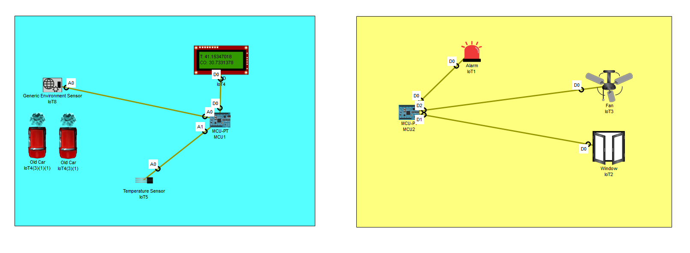
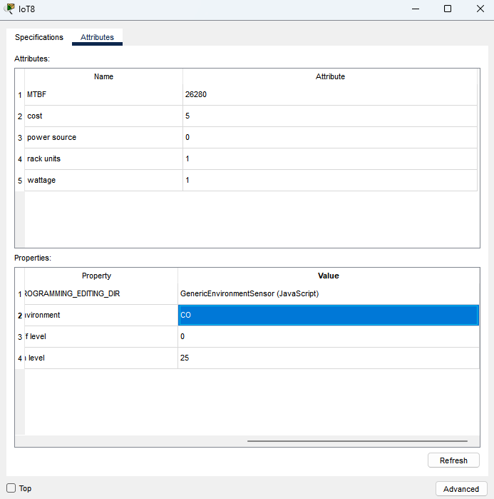
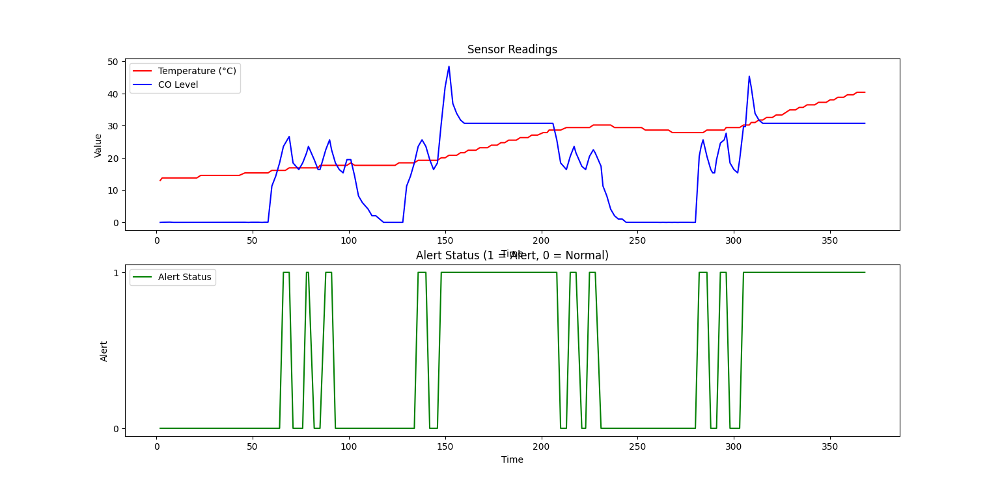

# Smart Factory Ventilation System

## Overview
This repository contains the implementation of a **Smart Factory Ventilation System** using **Python sockets** and **Cisco Packet Tracer**. The system consists of **two MCUs** (MCU1 and MCU2) that interact with a cloud-based server to monitor and regulate air quality. The cloud application processes sensor data and sends control commands to maintain optimal environmental conditions.

## System Architecture



## Features
- **Real-time monitoring** of temperature and CO levels
- **Automated control** of fan and window based on sensor readings
- **Live data visualization** using Matplotlib
- **TCP-based communication** between cloud and MCUs
- **Fully simulated environment** in Cisco Packet Tracer

## File Structure
```
📁 Smart-Factory-Ventilation-System
│-- 📁 Figures/                    # Contains screenshots and visualization outputs
│-- HW1-1-cloud.py                # Cloud server implementation
│-- HW1-1-edge.pkt                 # Cisco Packet Tracer project file
│-- mcu1.py                        # MCU1 sensor data transmitter
│-- mcu2.py                        # MCU2 actuator control receiver
│-- Project_Demonstration.mkv      # Demonstration video of system execution
│-- README.md                      # This file
│-- Report.docx                     # Detailed project report
```

## Getting Started
### 1. Prerequisites
Ensure you have the following installed:
- **Python 3**
- **Matplotlib** (`pip install matplotlib`)
- **Cisco Packet Tracer**

### 2. Running the Project
#### Step 1: Start the Cloud Server
Run the cloud server first:
```bash
python HW1-1-cloud.py
```

#### Step 2: Open Cisco Packet Tracer
- Load `HW1-1-edge.pkt`
- Run `MCU1.py` first (simulated CO & temperature readings)
- Run `MCU2.py` next (controls the fan and window based on cloud commands)

#### Step 3: Monitor the Dashboard
The **Matplotlib live dashboard** will continuously update sensor readings and control actions.

## System Workflow
1. **MCU1 reads** temperature and CO levels and sends data to the cloud.
2. **Cloud processes data** and checks if the values exceed predefined thresholds:
   - **Temperature Threshold**: 35°C
   - **CO Level Threshold**: 20 ppm
3. If any threshold is exceeded, the **cloud sends control commands** to MCU2.
4. **MCU2 activates the fan and opens the window** to reduce CO levels.
5. The **real-time graph updates continuously**, reflecting changes in environmental conditions.

## Challenges & Solutions
### 1. Handling Multiple Clients Simultaneously
- Problem: Initial implementation supported only one client at a time.
- Solution: Modified the alert server to dynamically open and close connections.

### 2. Lack of a CO Sensor in Packet Tracer
- Problem: No dedicated CO sensor in Cisco Packet Tracer.
- Solution: Used a **generic environmental sensor** and replace **Water Level** Environment Attribute with "CO".



## Results
- **Successful data transmission** from MCU1 to the cloud
- **Effective real-time monitoring** of temperature and CO levels
- **Automatic fan and window control** to maintain air quality
- **Fully functional dashboard visualization**



## Future Improvements
- Implement **MQTT** for more efficient messaging
- Integrate **actual CO sensors** when hardware is available
- Enhance the **graphical user interface** for better readability

## Demonstration
A **video demonstration** of the working project is included: `Project_Demonstration.mkv`

## Contributors
- **AK Nahin** – Developed and tested the system

## License
This project is for educational purposes and follows the guidelines set by **King Fahd University of Petroleum and Minerals**.

